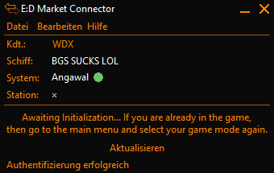
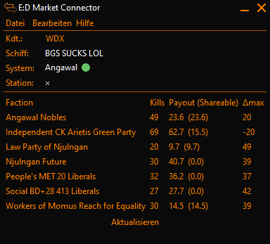
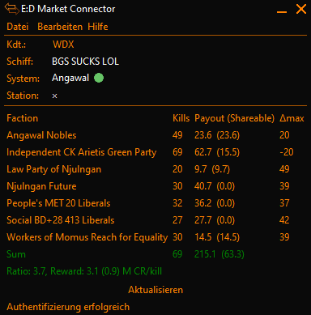

# ED Market Connector - Massacre Plugin
This plugin is designed to aid you with stacking massacre missions.
When running, it will display a table with all mission givers.

**WARNING**: This Plugin uses features from the 5.0.0-beta1 build. 
It will fail to load the settings on an earlier build.

You can get the beta-build [here](https://github.com/EDCD/EDMarketConnector/releases/tag/Release%2F5.0.0-beta1)

## Screenshots
Before initialisation:

Once initialised (only delta row selected):

Once initialised (all extra parameters selected):

## Installation
Download the source and place it inside the plugins folder.
To open the folder, inside EDMC go to File > Settings

Head to the Plugins Tab and open the folder. Place the folder here.
After a restart the plugin should show up in the Plugins-Tab.