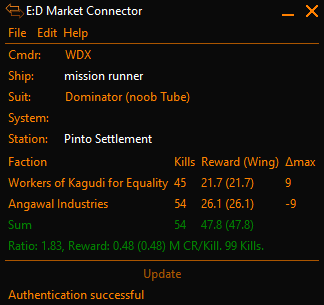

# ED Market Connector - Massacre Plugin
This is a plugin for [Elite Dangerous Market Connector](https://github.com/EDCD/EDMarketConnector).

Its purpose is to help you keep track of accepted Massacre-type missions in the game "Elite Dangerous".

The plugin displays a table showing how many kills are required per Faction.  
If you are new to Massacre Stacking, you could take a look at [this article](https://sites.google.com/view/ed-pve-combat/making-money).

  

## Usage

Simply start EDMC and the Game. If you start EDMC after the game the plugin will ask you to go
to main menu and back.

From then on, start stacking missions :)  
For each added or abandoned / completed missions the Table will update.

### How to read

### Updates
The plugin pings GitHub on Startup to check if a new version is available. The plugin will notify you in the UI if
a new version is available. You can off this behaviour in the Settings.