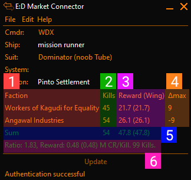

# ED Market Connector - Massacre Plugin
This is a plugin for [Elite Dangerous Market Connector](https://github.com/EDCD/EDMarketConnector).

Its purpose is to help you keep track of accepted Massacre-type missions in the game "Elite Dangerous".

The plugin displays a table showing how many kills are required per Faction.  
If you are new to Massacre Stacking, you could take a look at [this article](https://sites.google.com/view/ed-pve-combat/making-money).

    
     
    Screenshot of EDMC with the Plugin running.

## Usage

Simply start EDMC and the Game. If you start EDMC after the game the plugin will ask you to go
to main menu and back.

From then on, start stacking missions :)  
For each added or abandoned / completed missions the Table will update.

### How to read

Below you can see the main table's explanation:

    
     

1. These are the mission givers
2. This is the sum of kills from all massacre missions handed out by that mission giver
3. This is how much reward you will get upon completion, in Millions. The Value in brackets indicates how much of that is shareable with a wing.
4. This is the Delta-Column. It displays the difference to the highest stack. The highest stack shows the difference to the second-highest stack and can be identified by the `-`
5. The Sum-Row shows show many Kills you need to do in total, and how big the total reward is.
6. More details showing the stack ratio (see below), rewards normalized per required kill, and the sum of all Mission-Kills.

**Stack-Ratio**: This figure tells you how effective you stack is. It is calculated as follows:  
`stack_ratio = all_mission_kills / required_kills`. It is a value >= 1. The higher, the better.
A Stack-ratio of 1 for example would be just taking missions from one faction. In the example above the stack ratio is `1.83 = sum([45, 54]) / max([45, 54])`.

### Updates
The plugin pings GitHub on Startup to check if a new version is available. The plugin will notify you in the UI if
a new version is available. You can turn off this behaviour in the Settings.

The Version check is the only time the plugins does a Web-Call. And all it does is a GET to the [version file](./version).

### File Access
Because EDMC does not keep track of Missions the plugin will read through the last 2 weeks of logs on startup
and collect all Mission-Events.

Also, when doing an Update-Check the `version`-File is read.