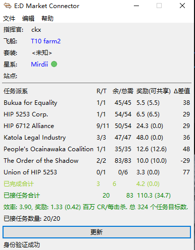
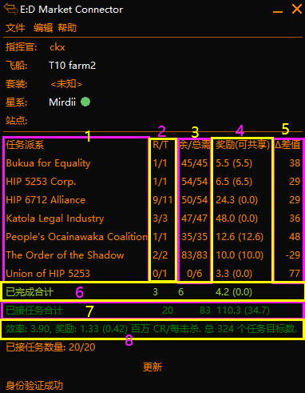

# EDMC - 清缴任务插件
这是 [EDMC](https://github.com/EDCD/EDMarketConnector) 的一个插件

其目的是帮助你在游戏《Elite Dangerous》中跟踪已接受的 Massacre 类型任务。

该插件显示一个表格，展示每个派系需要多少击杀。 
如果您是初次接触清缴堆叠，可以阅读[这篇文章](https://tieba.baidu.com/p/9327050589).

    
     

## 用法

只需启动 EDMC 和游戏。如果在游戏启动后才启动 EDMC，插件会要求您返回主菜单再重新进入。

从那时起，开始堆叠任务 :) 
每添加或放弃/完成任务时，表格都会更新。 
每个任务的击杀数量完成时也会更新状态

### 如何查看

下面你可以看到关于表格的解释：

    
     

1. 这些是任务发布者,显示为各个派系 
2. 这些是该派系的任务数量,用于显示 `还剩几个未完成目标击杀数的 / 该派系任务总数`
3. 这是由该任务发布者分发的:  `剩余需要完成击杀目标数的合计 / 所有清缴任务中击杀数的总和` 
    (因无法准确的统计个数,所以使用单个任务的数量来大致计算)
4. 这是完成后你将获得的奖励，以百万为单位。括号中的数值表示其中可分享给小队成员的金额。
5. 这是 Delta 列。它显示与最高堆叠的差异。最高堆叠显示与第二高堆叠的差异，并可通过 `-` 标识。 
6. 已完成合计行显示你目前的进度:  `已完成击杀目标的任务个数`  `已完成的击杀数量`  `完成部分的奖励规模`
7. 已接任务合计行显示了你合计任务数量，总共需要完成的击杀次数，以及总奖励。
8. 更多细节展示了堆叠效率（见下文）、每次所需击杀的奖励标准化值，以及所有任务击杀的总和。

**堆叠效率**: 这个数值告诉你堆叠的效果如何。其计算方式如下： 
`stack_ratio = all_mission_kills / required_kills`. 
它是一个 >=1 的值。数值越高，效果越好。例如，堆叠效率为 1 意味着只从一个派系接取任务。 
在上面的例子中，堆叠效率为 `1.83 = sum([45, 54]) / max([45, 54])`. 
因为当你完成一个击杀目标时,不同派系的任务均会使击杀完成数+1

### 更新
该插件在启动时会向 GitHub 发送请求以检查是否有新版本可用。如果有新版本，插件会在 UI 中通知你。你可以在设置中关闭此行为。

更新检查是本插件会唯一进行网络通信的部分。它所做的只是对[版本文件](./version)执行 GET 请求。

### 文件访问
由于 EDMC 不会跟踪任务，插件将在启动时读取过去 2 周的日志并收集所有任务事件。

此外，在进行更新检查时，会读取 `version` 文件

## 集成功能
此插件具有集成功能。你可以将它们视为该插件的插件。欢迎提交拉取请求以添加新的集成。如有任何问题，请创建一个Issue :)

### edmcoverlay (Linux)
此集成增加了将数据发送到 Linux 版 edmcoverlay 的选项。当你接取新任务时，当前堆栈将作为覆盖层显示。感谢 [@pan-mroku](https://github.com/pan-mroku) 的 Pull Request。

另外也支持windows版的edmcoverlay

## Acknowledgments
[ckx000](https://github.com/ckx000/EDMC-Massacres) 
[AlphaConqueror](https://github.com/AlphaConqueror/EDMC-Massacres) 
[CMDR-WDX](https://github.com/CMDR-WDX/EDMC-Massacres)